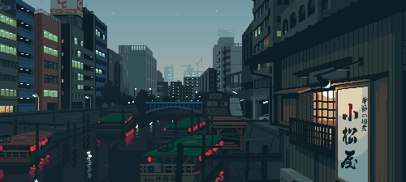

<h1 align="left">👋 Hello there! I'm Maksim Morozov</h1>

 

<h2 align="left" id="morrmaks-stack">🔥 Tech stack</h2>

> General

<table width='100%'>
  <tr>
    <td align="center" width="110" height="90">
      
       javascript
    </td>
    <td align="center" width="110" height="90">
      
       typescript
    </td>
        <td align="center" width="110" height="90">
      
       HTML5
    </td>
         <td align="center" width="110" height="90"> 
      
       CSS3
    </td>
    <td align="center" width="110" height="90">
      
       figma
    </td>
    <td align="center" width="110" height="90">
      
       git
    </td>
    <td align="center" width="110" height="90"> 
      
       pnpm
    </td>
    <td align="center" width="110" height="90"> 
      
       npm
    </td>
     <td align="center" width="110" height="90"> 
      
       github
    </td>
    <td align="center" width="110" height="90"> 
      
       docker
    </td>
  </tr> 
</table>

> Testing

<table width='100%'>
  <tr>
     <td align="center" width="110" height="90"> 
      
       Jest
    </td>
    <td align="center" width="110" height="90"> 
      
       React Testing Library
    </td>
        <td align="center" width="110" height="90"> 
      
       storybook
    </td>
    <td align="center" width="110" height="90"> 
      
       cypress
    </td>
    <td align="center" width="110" height="90"> 
      
       playwright
    </td>
  </tr> 
</table>

> Code quality

<table width='100%'>
  <tr>
     <td align="center" width="110" height="90">
      
       eslint
    </td>
    <td align="center" width="110" height="90">
      
       prettier
    </td>
        <td align="center" width="110" height="90">
      
       stylelint
    </td>
  </tr> 
</table>

> Frontend

<table width='100%'>
  <tr>
   <td align="center" width="110" height="90">
      
       React
    </td>
     <td align="center" width="110" height="90">
      
       Next JS
    </td>
 <td align="center" width="110" height="90">
      
       Redux
    </td>
    <td align="center" width="110" height="90"> 
      
       Zustand
    </td>
     <td align="center" width="110" height="90">
      
       ShadcnUI
    </td>
  </tr> 
    <tr>
     <td align="center" width="110" height="90"> 
      
       Apollo
    </td>
    <td align="center" width="110" height="90"> 
      
       Webpack
    </td>
    <td align="center" width="110" height="90"> 
      
       Vite
    </td> 
    <td align="center" width="110" height="90">
      
       Sass
    </td>
        <td align="center" width="110" height="90">
      
       Less
    </td>
   <td align="center" width="110" height="90">
      
       Tailwind
    </td>
  </tr> 
</table>

> Backend

<table width='100%'>
  <tr>
    <td align="center" width="110" height="90"> 
      
       Node JS
    </td>
    <td align="center" width="110" height="90"> 
      
       Express
    </td>
    <td align="center" width="110" height="90">
      
       GraphQL
    </td>
    <td align="center" width="110" height="90">
      
       MongoDB
    </td>
  </tr> 
</table>
